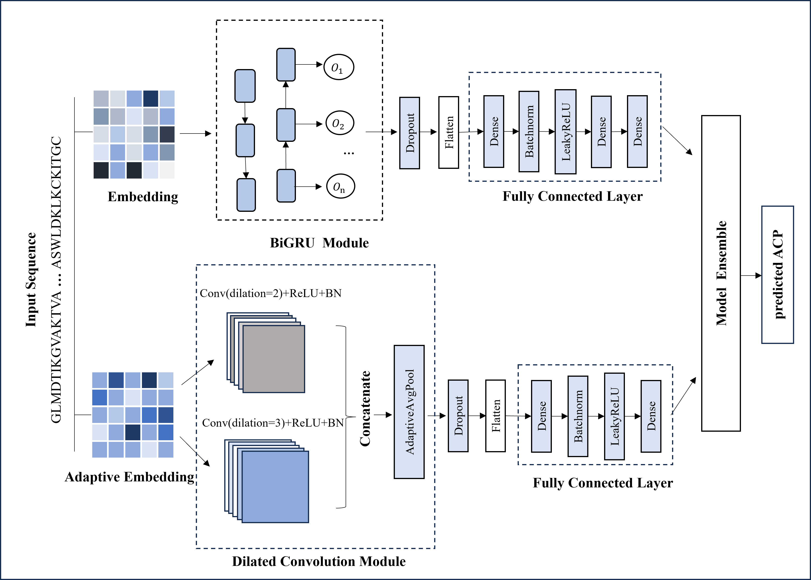

# ACP-DPE: a dual-channel deep learning model for anticancer peptide prediction

## Introduction

Cancer is a serious and complex disease caused by uncontrolled cell growth and is becoming one of the leading causes of death worldwide. Anticancer peptides (ACPs), as a bioactive peptide with lower toxicity, emerge as a promising means of effectively treating cancer. Identifying ACPs is challenging due to the limitation of experimental conditions. To address this, we proposed a dual-channel-based deep learning method, termed ACP-DPE, for ACP prediction. The ACP-DPE consisted of two parallel channels:  one was an embedding layer followed by the bi-directional gated recurrent unit (Bi-GRU) module, and the other was an adaptive embedding layer followed by the dilated convolution module. The Bi-GRU module captured the peptide sequence dependencies, while the dilated convolution module characterized the local relationship of amino acids.

## Code details

* Users can run the Test.py to identify anticancer peptide.
* main_model.pt: model weights file for the main dataset.
* alt_model.pt: model weights file for the alternate dataset.

## Dataset

* ACP20mainTrain.csv: samples training set for the main dataset
* ACP20mainTest.csv: samples testing set for the main dataset
* ACP20altTrain.csv: samples training set for the alternate dataset
* ACP20mainTest.csv: samples testing set for the alternate dataset

## robustness_test

* processed_ACP20mainTrain_1.csv: training set samples after shuffling of amino acid residues of 1% positive samples from the main dataset
* processed_ACP20mainTrain_2.csv: training set samples after shuffling of amino acid residues of 2% positive samples from the main dataset
* processed_ACP20mainTrain_3.csv: training set samples after shuffling of amino acid residues of 3% positive samples from the main dataset
* processed_ACP20mainTrain_4.csv: training set samples after shuffling of amino acid residues of 4% positive samples from the main dataset
* processed_ACP20mainTrain_5.csv: training set samples after shuffling of amino acid residues of 5% positive samples from the main dataset

## Dependency

* python 3.8
* torch 1.12.1
* numpy 1.22.0
* pandas 1.4.2
* scikit-learn 1.0.2 